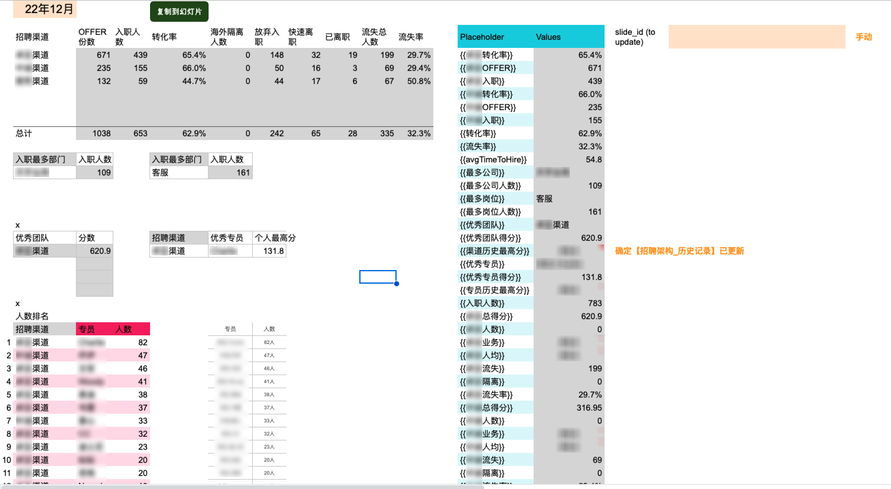

# Recruitment Annual Report

This script is for automation of recruitment departments' annual report. Data source is collected and stored in this google sheet: https://docs.google.com/spreadsheets/d/1xzfBARecn37kOvcQco0Kyb-iBTmfykqwd8cmKlfLCJE/edit?gid=1634284674#gid=1634284674, where the data is cleaned, analyzed and prepared in a worksheet called '数据整理', which is full of google sheets formula：



After getting all data prepared, a button is clicked to run the script below:

```javascript
function replaceSlideTexts() {
  const ss = SpreadsheetApp.getActiveSpreadsheet().getSheetByName('数据整理');
  const range = ss.getRange('P4:Q');
  const rangeContents = range.getDisplayValues();
  const slideUrl = ss.getRange('T3').getValue();

  for(let i=0; i < ss.getRange('P4:P').getValues().filter(String).length; i++){
    replaceAllText(slideUrl, rangeContents[i][0], rangeContents[i][1]);
  };
}

function replaceAllText(slideUrl, originalTexts, replacingTexts){
  const all_slides = SlidesApp.openByUrl(slideUrl).getSlides();
  all_slides.forEach(function(slide){
    const shapes = slide.getShapes();
    shapes.forEach(function(shape) {
      shape.getText().replaceAllText(originalTexts, replacingTexts);
    });
  });
}
```

Basically, what the script does is to replace texts in '{{}}' in the template below with the data prepared in the '数据整理' worksheet:

The template:


The result:

source: https://docs.google.com/presentation/d/1RR6cORR0oCjkoOI8ep8FqA_7fEfoAtUfmAI8DL9Pb_I/edit?usp=drive_link

The slides actually consist of a lot more pages. By applying the script, I could improve my productivity by minimizing my time spent on repeated and boring tasks and at the same time maximize the accuracy.